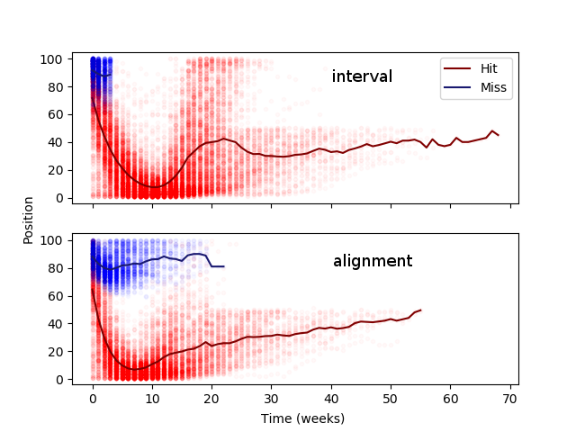

# Master's thesis: Modelling Chart Trajectories using Song Features
This will be my attempt at making the code from my [master's thesis](https://uwspace.uwaterloo.ca/handle/10012/14937) avaiable for those who are curious and/or want to dabble into music information retrieval. I've simplified some of the pathing and updated some comments to make things more readable. 

In my thesis, I proposed two target variables for modelling hits and flops, which I then attemped to model with various forms of logistic regression.



I presented it on August 16, 2019 ([announcement](https://uwaterloo.ca/artificial-intelligence-group/events/masters-thesis-presentation-modelling-chart-trajectories)). My slides can be found [here](http://www.jperrie.com/thesis_presentation_08_16_19.pdf).

# Data acquisition
1. Chart data: [billboard.py](https://github.com/guoguo12/billboard-charts), [weekly Billboard Hot 100](https://www.billboard.com/charts/hot-100/1958-08-04)
2. Lyrics data: Musixmatch, [the Million Song Dataset](http://millionsongdataset.com/)
  * [Lyrics](http://millionsongdataset.com/sites/default/files/AdditionalFiles/mxm_dataset.db)
  * [Metadata](http://millionsongdataset.com/sites/default/files/AdditionalFiles/track_metadata.db)
3. Audio features: [spotipy](https://spotipy.readthedocs.io/en/latest/), [The Echo Nest](https://developer.spotify.com/documentation/web-api/reference/tracks/get-audio-features/)

# Pre-processing
1. Similarity measure inspired by [Askin & Mauskapf](https://journals.sagepub.com/doi/abs/10.1177/0003122417728662)
2. [LDA topic modelling](http://mallet.cs.umass.edu) of BOW lyrics
3. Normalizing features
4. Matching records
5. [Genre labelling](https://developer.spotify.com/documentation/web-api/reference/artists/get-artist/) 

# General workflow 
### Data acquisition
```
python billboard.py (get chart data)
python control.py (get chart metadata controls)
python BOW.py (get BOW)
python spotify.py (get Spotify IDs)
python echo_genre_features.py (get The Echo Nest features) 
python genre.py (get Spotify genre tags)
python discog_data.py (get Discog genre tags)
```
### Feature derivation
```
python build_ts.py (build chart time series)
Rscript dtw_1.R (distance matrix)
python cluster_target.py (clustering)
python tm_prep.py (prepare BOW representation for topic model)
javac topic_model.java (apply LDA)
java topic_model (apply LDA)
python typ_echo_ng_decay.py (similarity The Echo Nest)
python typ_tm_ng_decay.py (similarity topic model)
python typ_echo_paper.py (similarity critique)
python typ_echo_paper_1b.py (similarity critique Spotify genres)
```
### Model pre-processing
```
python model_prep_paper.py (critique features)
python model_prep_paper_1b.py (critique features Spotify genres)
python build_feature_model.py (model features)
python build_feature_ts.py (model features as time series)
```
### Visualizations 
```
python trajectory_snippet_comparing_ts.py (chart trajectory plotting)
Rscript mosaic_anal.R (cluster labels as a mosaic plot)
python temp_anal.py (temporal analysis of model features)
```
### Modeling 
```
Rscript generalized_compare.R (binary classification logistic regression modeling)
Rscript generalized_lasso.R (interval target variable lasso logistic regression modeling)
Rscript multi_lasso_align.R (multi-class one-against-all lasso logistic regression modeling)
Rscript paper_1_analysis.R # (critique ordered logit modeling)
```
